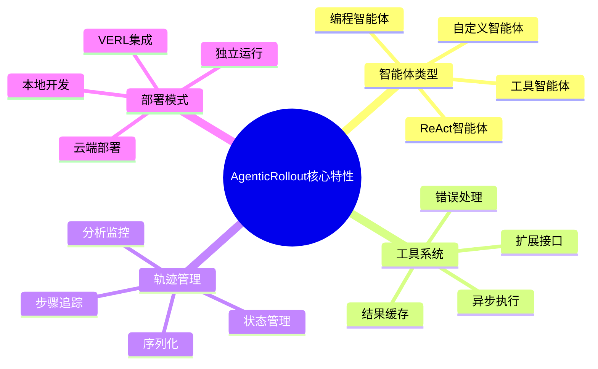
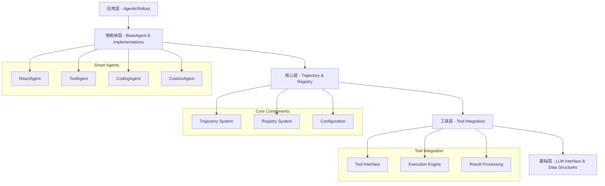
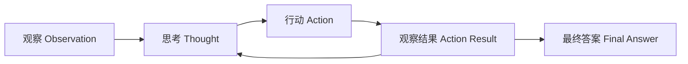
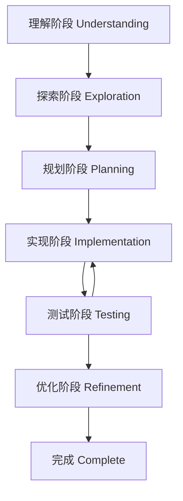

# AgenticRollout Library Technical Design Document

**Version**: 1.0  
**Date**: 2025-01-21  
**Authors**: VERL Development Team  

---

## Table of Contents

1. [项目概述](#1-项目概述)
2. [系统架构设计](#2-系统架构设计)  
3. [智能体类型详解](#3-智能体类型详解)
4. [工具集成系统](#4-工具集成系统)
5. [轨迹管理系统](#5-轨迹管理系统)
6. [配置和部署](#6-配置和部署)
7. [当前版本支持内容](#7-当前版本支持内容)
8. [开发和扩展指南](#8-开发和扩展指南)
9. [示例和用例](#9-示例和用例)
10. [性能和监控](#10-性能和监控)
11. [未来发展规划](#11-未来发展规划)

---

## 1. 项目概述

### 1.1 项目背景

AgenticRollout库是VERL (Volcano Engine Reinforcement Learning)框架中的一个核心组件，专门用于实现多步骤智能体工作流。该库的设计初衷是为了解决传统单步LLM生成的局限性，通过引入思考-行动-观察的循环模式，使AI系统能够执行更复杂的推理和问题解决任务。

**核心价值**：
- **多步推理能力**: 支持复杂的多步骤思考和行动序列
- **工具集成**: 无缝集成各种外部工具和API
- **独立运行**: 可以脱离VERL框架独立使用
- **生产就绪**: 完善的错误处理、监控和性能优化

### 1.2 设计目标

#### 主要目标
1. **模块化设计**: 清晰的接口分离，便于扩展和维护
2. **高性能**: 支持异步处理和并发执行
3. **可扩展性**: 易于添加新的智能体类型和工具
4. **容错性**: 强大的错误处理和恢复机制
5. **监控友好**: 内置性能指标和轨迹分析

#### 技术目标
- **异步架构**: 基于asyncio的非阻塞执行
- **类型安全**: 完整的类型注解和验证
- **配置驱动**: 灵活的配置系统支持多种部署场景
- **测试覆盖**: 全面的单元测试和集成测试

### 1.3 核心特性



---

## 2. 系统架构设计

### 2.1 整体架构

AgenticRollout库采用分层架构设计，主要包含以下几个层次：



### 2.2 核心组件详解

#### 2.2.1 AgenticRollout (主控制器)

**职责**：
- 协调整个智能体执行流程
- 管理LLM调用和工具集成
- 处理批量请求和并发控制
- 提供VERL协议兼容接口

**关键方法**：
```python
class AgenticRollout:
    async def generate_sequences(self, prompts: DataProto) -> DataProto
    def _create_agent(self) -> BaseAgent
    async def _generate_trajectories_batch(self, prompt_list: List[Dict]) -> List[Trajectory]
    def _trajectories_to_data_proto(self, trajectories: List[Trajectory], original_prompts: DataProto) -> DataProto
```

#### 2.2.2 BaseAgent (智能体抽象基类)

**设计理念**：
- 定义所有智能体的通用接口
- 提供默认的轨迹管理逻辑
- 支持工具集成的基础框架

**核心接口**：
```python
class BaseAgent(ABC):
    @abstractmethod
    async def run_trajectory(self, prompt: Dict[str, Any], llm_generate_func, request_id: str, **kwargs) -> Trajectory
    
    def should_continue(self, trajectory: Trajectory) -> bool
    def create_system_prompt(self) -> str
    async def execute_tool_call(self, tool_name: str, tool_args: Dict[str, Any], trajectory: Trajectory) -> TrajectoryStep
```

#### 2.2.3 Registry System (注册系统)

**功能**：
- 智能体类型的动态注册和发现
- 支持插件式扩展
- 类型安全的智能体实例化

**实现机制**：
```python
# 全局注册表
_AGENT_REGISTRY: Dict[str, Type] = {}

@register_agent("custom_agent")
class CustomAgent(BaseAgent):
    pass

# 获取智能体类
agent_class = get_agent_class("custom_agent")
```

### 2.3 设计原则

#### 2.3.1 单一职责原则
每个组件都有明确的职责边界：
- **AgenticRollout**: 流程协调和接口适配
- **Agent**: 智能体逻辑和决策
- **Trajectory**: 状态管理和历史记录
- **Tools**: 外部操作执行

#### 2.3.2 开闭原则
系统对扩展开放，对修改封闭：
- 通过继承BaseAgent添加新智能体类型
- 通过实现工具接口添加新工具
- 通过配置系统调整行为参数

#### 2.3.3 依赖倒置原则
高层模块不依赖低层模块：
- AgenticRollout依赖BaseAgent抽象
- Agent依赖工具接口而非具体实现
- 通过依赖注入实现松耦合

---

## 3. 智能体类型详解

### 3.1 ReactAgent (推理-行动智能体)

#### 设计思路
ReactAgent实现了"Reasoning + Acting"模式，这是一种经典的智能体范式，通过思考-行动-观察的循环来解决复杂问题。



#### 核心特性
- **交替思考和行动**: 确保每个行动都经过深思熟虑
- **自我反思**: 根据行动结果调整后续策略
- **灵活终止**: 多种终止条件确保任务完成

#### 配置参数
```python
@dataclass
class ReactAgentConfig:
    require_thought_before_action: bool = True      # 行动前必须思考
    max_consecutive_thoughts: int = 3               # 最大连续思考步数
    enable_self_reflection: bool = True             # 启用自我反思
```

#### 工作流程
1. **初始观察**: 接收问题描述
2. **思考阶段**: 分析当前情况和可选行动
3. **行动阶段**: 执行工具调用或给出答案
4. **结果观察**: 处理工具执行结果
5. **循环决策**: 判断是否需要继续

#### 输出格式规范
```python
# 思考步骤
"Thought: I need to calculate the factorial of 5 to solve this problem."

# 行动步骤  
"Action: calculator(operation='factorial', n=5)"

# 最终答案
"Action: Final Answer: The factorial of 5 is 120."
```

### 3.2 ToolAgent (工具智能体)

#### 设计理念
ToolAgent专注于高效的工具调用，适用于明确知道需要使用哪些工具的场景，减少不必要的思考开销。

#### 核心特性
- **直接工具调用**: 简化的工具调用流程
- **批量操作**: 支持一次调用多个工具
- **结果聚合**: 智能整合多个工具的输出

#### 工具调用格式
```python
# 单工具调用
"TOOL_CALL: search_engine(query='Python asyncio tutorial')"

# 多工具调用
"TOOL_CALL: calculator(expression='2+2')"
"TOOL_CALL: web_search(query='math calculation verification')"
"Based on the calculations and verification, the answer is 4."
```

#### 适用场景
- 已知工具需求的简单任务
- 需要快速执行的工具调用
- 批量数据处理场景

### 3.3 CodingAgent (编程智能体)

#### 设计特色
CodingAgent是专门为软件工程任务设计的智能体，实现了软件开发的完整生命周期管理。

#### 阶段化工作流程



#### 状态管理
```python
@dataclass
class CodebaseState:
    viewed_files: Set[str]                    # 已查看的文件
    modified_files: Set[str]                  # 已修改的文件  
    test_results: Dict[str, Any]              # 测试结果
    search_cache: Dict[str, List[str]]        # 搜索结果缓存
    current_dir: str                          # 当前工作目录
    errors_encountered: List[str]             # 错误历史
    implementation_plan: List[str]            # 实现计划
```

#### 必需工具集
CodingAgent需要以下工具支持：
- `view_file`: 查看文件内容
- `edit_file`: 编辑文件
- `create_file`: 创建新文件
- `search_code`: 代码搜索
- `search_files`: 文件搜索
- `execute_bash`: 执行命令
- `run_tests`: 运行测试

#### 智能阶段转换
系统根据智能体的行为自动判断当前阶段：
```python
def _update_phase(self, trajectory: Trajectory):
    if self.current_phase == SWEPhase.UNDERSTANDING:
        if any(tool in action_types for tool in ["search_files", "view_file"]):
            self.current_phase = SWEPhase.EXPLORATION
    # ... 其他阶段转换逻辑
```

### 3.4 自定义智能体扩展

#### 扩展机制
通过继承BaseAgent和使用@register_agent装饰器，可以轻松创建自定义智能体：

```python
@register_agent("research")
class ResearchAgent(BaseAgent):
    def __init__(self, **kwargs):
        super().__init__(**kwargs)
        self.research_depth = kwargs.get("research_depth", 3)
        self.verification_enabled = kwargs.get("verification_enabled", True)
    
    async def run_trajectory(self, prompt, llm_generate_func, request_id, **kwargs):
        # 自定义智能体逻辑
        trajectory = Trajectory(request_id=request_id)
        # ... 实现研究流程
        return trajectory
```

#### 最佳实践
1. **明确定义智能体职责**: 每个智能体应该有清晰的应用领域
2. **合理设计状态管理**: 根据需要扩展状态跟踪
3. **实现智能终止条件**: 避免无限循环
4. **提供详细的系统提示**: 指导LLM生成合适的响应

---

## 4. 工具集成系统

### 4.1 工具接口设计

#### 统一工具接口
所有工具都应实现以下接口模式：

```python
class BaseTool:
    def __init__(self):
        self.description = "Tool description"
    
    async def execute(self, **kwargs) -> Any:
        """
        执行工具操作
        
        Args:
            **kwargs: 工具参数
            
        Returns:
            工具执行结果
            
        Raises:
            ToolExecutionError: 执行失败时抛出
        """
        pass
```

#### 工具元数据
工具可以通过元数据提供更多信息：

```python
class AdvancedTool:
    def __init__(self):
        self.description = "Advanced calculation tool"
        self.parameters_schema = {
            "type": "object",
            "properties": {
                "operation": {"type": "string", "enum": ["add", "multiply", "factorial"]},
                "operands": {"type": "array", "items": {"type": "number"}}
            },
            "required": ["operation"]
        }
        self.return_schema = {
            "type": "object", 
            "properties": {
                "result": {"type": "number"},
                "metadata": {"type": "object"}
            }
        }
```

### 4.2 工具执行引擎

#### 异步执行机制
工具执行引擎支持并发执行和超时控制：

```python
async def execute_tool_call(
    self,
    tool_name: str,
    tool_args: Dict[str, Any],
    trajectory: Trajectory
) -> TrajectoryStep:
    try:
        if tool_name not in self.tools:
            raise ValueError(f"Tool '{tool_name}' not available")
        
        tool = self.tools[tool_name]
        
        # 异步执行工具
        result = await asyncio.wait_for(
            tool.execute(**tool_args),
            timeout=self.tool_timeout
        )
        
        # 创建成功结果步骤
        result_step = TrajectoryStep(
            step_type=StepType.ACTION_RESULT,
            content=str(result),
            metadata={
                "tool_name": tool_name,
                "tool_args": tool_args,
                "execution_successful": True,
                "execution_time": time.time() - start_time
            },
            tool_name=tool_name,
            tool_args=tool_args,
            tool_result=result
        )
        
        return result_step
        
    except Exception as e:
        # 错误处理
        return self._create_error_step(tool_name, tool_args, e)
```

#### 结果处理和缓存
- **结果标准化**: 将不同工具的输出格式化为标准格式
- **结果缓存**: 缓存耗时工具的执行结果
- **错误恢复**: 智能的错误处理和重试机制

### 4.3 工具类型示例

#### 计算工具
```python
class CalculatorTool:
    async def execute(self, expression: str = None, operation: str = None, **kwargs):
        if expression:
            # 安全的数学表达式求值
            return self._safe_eval(expression)
        elif operation == "factorial":
            n = kwargs.get("n", 1)
            return math.factorial(n)
        # ... 其他操作
```

#### 搜索工具  
```python
class WebSearchTool:
    async def execute(self, query: str, max_results: int = 5):
        # 调用搜索API
        results = await self.search_api.search(query, limit=max_results)
        return {
            "query": query,
            "results": results,
            "total_count": len(results)
        }
```

#### 代码执行工具
```python
class CodeExecutorTool:
    async def execute(self, language: str, code: str, timeout: int = 10):
        # 在安全沙箱中执行代码
        result = await self._execute_in_sandbox(language, code, timeout)
        return {
            "stdout": result.stdout,
            "stderr": result.stderr, 
            "exit_code": result.exit_code,
            "execution_time": result.execution_time
        }
```

### 4.4 工具安全和限制

#### 安全措施
1. **输入验证**: 严格验证工具参数
2. **沙箱执行**: 隔离环境执行危险操作
3. **资源限制**: 限制CPU、内存、时间使用
4. **权限控制**: 基于角色的工具访问控制

#### 使用限制
```python
@dataclass
class ToolLimits:
    max_execution_time: float = 30.0      # 最大执行时间(秒)
    max_memory_usage: int = 100 * 1024**2  # 最大内存使用(字节) 
    max_output_size: int = 10 * 1024       # 最大输出大小(字节)
    rate_limit: int = 10                   # 每分钟最大调用次数
```

---

## 5. 轨迹管理系统

### 5.1 数据结构设计

#### TrajectoryStep (轨迹步骤)
每个轨迹步骤包含以下核心信息：

```python
@dataclass
class TrajectoryStep:
    step_type: StepType                    # 步骤类型
    content: str                           # 步骤内容
    metadata: Dict[str, Any]               # 元数据
    
    # 工具相关字段
    tool_name: Optional[str] = None        # 工具名称
    tool_args: Optional[Dict[str, Any]] = None  # 工具参数
    tool_result: Optional[Any] = None      # 工具结果
    
    # 评估相关字段
    reward_score: Optional[float] = None   # 奖励分数
    is_correct: Optional[bool] = None      # 是否正确
    
    # 生成相关字段
    log_probs: Optional[List[float]] = None     # 对数概率
    attention_mask: Optional[List[int]] = None  # 注意力掩码
```

#### StepType (步骤类型)
定义了轨迹中的所有步骤类型：

```python
class StepType(Enum):
    OBSERVATION = "observation"      # 观察/输入
    THOUGHT = "thought"              # 思考/推理
    ACTION = "action"                # 行动/工具调用
    ACTION_RESULT = "action_result"  # 行动结果
    FINAL_ANSWER = "final_answer"    # 最终答案
```

#### Trajectory (轨迹)
完整的轨迹包含多个步骤和元数据：

```python
@dataclass 
class Trajectory:
    request_id: str                        # 请求ID
    steps: List[TrajectoryStep]            # 步骤列表
    metadata: Dict[str, Any]               # 轨迹元数据
    
    # 状态字段
    is_completed: bool = False             # 是否完成
    final_reward: Optional[float] = None   # 最终奖励
    total_tokens: int = 0                  # 总token数
```

### 5.2 轨迹操作

#### 轨迹构建
```python
# 创建新轨迹
trajectory = Trajectory(request_id="task_001")

# 添加观察步骤
trajectory.add_step(TrajectoryStep(
    step_type=StepType.OBSERVATION,
    content="What is the capital of France?",
    metadata={"source": "user_input"}
))

# 添加思考步骤
trajectory.add_step(TrajectoryStep(
    step_type=StepType.THOUGHT, 
    content="I need to recall the capital city of France.",
    metadata={"reasoning_type": "knowledge_recall"}
))

# 添加最终答案
trajectory.add_step(TrajectoryStep(
    step_type=StepType.FINAL_ANSWER,
    content="The capital of France is Paris.",
    metadata={"confidence": 0.95}
))
```

#### 轨迹查询
```python
# 获取最终响应
final_response = trajectory.get_final_response()

# 获取所有工具调用
tool_calls = trajectory.get_tool_calls()

# 计算总奖励
total_reward = trajectory.get_total_reward()

# 转换为消息格式
messages = trajectory.get_messages()
```

### 5.3 序列化和持久化

#### JSON序列化
```python
# 序列化为字典
trajectory_dict = trajectory.to_dict()

# 从字典恢复
recovered_trajectory = Trajectory.from_dict(trajectory_dict)

# 保存到文件
with open("trajectory.json", "w") as f:
    json.dump(trajectory_dict, f, indent=2)
```

#### 序列化示例
```json
{
  "request_id": "task_001",
  "steps": [
    {
      "step_type": "observation",
      "content": "What is 2+2?",
      "metadata": {"timestamp": "2025-01-21T10:00:00"},
      "tool_name": null,
      "tool_args": null,
      "tool_result": null,
      "reward_score": null,
      "is_correct": null
    },
    {
      "step_type": "action", 
      "content": "calculator(expression='2+2')",
      "metadata": {"timestamp": "2025-01-21T10:00:01"},
      "tool_name": "calculator",
      "tool_args": {"expression": "2+2"},
      "tool_result": 4,
      "reward_score": null,
      "is_correct": null
    },
    {
      "step_type": "final_answer",
      "content": "The answer is 4.",
      "metadata": {"timestamp": "2025-01-21T10:00:02"},
      "tool_name": null,
      "tool_args": null, 
      "tool_result": null,
      "reward_score": 1.0,
      "is_correct": true
    }
  ],
  "metadata": {
    "agent_type": "react",
    "total_time": 2.1,
    "llm_calls": 2
  },
  "is_completed": true,
  "final_reward": 1.0,
  "total_tokens": 45
}
```

### 5.4 轨迹分析

#### 性能指标
```python
class TrajectoryAnalyzer:
    @staticmethod
    def analyze_efficiency(trajectory: Trajectory) -> Dict[str, float]:
        """分析轨迹效率"""
        total_steps = len(trajectory.steps)
        tool_steps = len(trajectory.get_tool_calls())
        thought_steps = len([s for s in trajectory.steps if s.step_type == StepType.THOUGHT])
        
        return {
            "tool_ratio": tool_steps / total_steps if total_steps > 0 else 0,
            "thought_ratio": thought_steps / total_steps if total_steps > 0 else 0,
            "steps_per_tool": total_steps / tool_steps if tool_steps > 0 else float('inf'),
            "efficiency_score": tool_steps / max(total_steps, 1)
        }
    
    @staticmethod 
    def identify_patterns(trajectories: List[Trajectory]) -> Dict[str, Any]:
        """识别轨迹模式"""
        patterns = {
            "average_steps": sum(len(t.steps) for t in trajectories) / len(trajectories),
            "success_rate": sum(1 for t in trajectories if t.is_completed) / len(trajectories),
            "common_tool_sequences": [],
            "failure_points": []
        }
        return patterns
```

#### 质量评估
- **完成率**: 轨迹是否成功完成
- **效率指标**: 步骤数量、工具使用比例  
- **错误分析**: 失败点和错误类型
- **奖励分析**: 奖励分布和优化建议

---

## 6. 配置和部署

### 6.1 配置系统

#### AgenticRolloutConfig
主要配置类包含所有可配置参数：

```python
@dataclass
class AgenticRolloutConfig:
    # 智能体配置
    agent_type: str = "react"                    # 智能体类型
    max_steps: int = 10                          # 最大步骤数
    max_tokens_per_step: int = 512               # 每步最大token数
    temperature: float = 0.7                     # 生成温度
    
    # 工具和交互配置
    tools_config: Optional[Dict[str, Any]] = None          # 工具配置
    interactions_config: Optional[Dict[str, Any]] = None   # 交互配置
    
    # 性能设置
    batch_size: int = 1                          # 批量大小
    concurrent_requests: int = 4                 # 并发请求数
    
    # 输出设置  
    include_trajectory_in_output: bool = True    # 输出中包含轨迹
    save_trajectories: bool = False              # 保存轨迹到磁盘
    trajectory_save_path: Optional[str] = None   # 轨迹保存路径
```

#### YAML配置示例
```yaml
# agentic_rollout_config.yaml
actor_rollout_ref:
  rollout:
    name: agentic
    agent_type: react
    max_steps: 10
    max_tokens_per_step: 512
    temperature: 0.7
    
    # 工具配置
    tools_config:
      tools:
        - class_name: "verl.tools.calculator.CalculatorTool"
          config:
            precision: 10
          tool_schema:
            type: "function"
            function:
              name: "calculate"
              description: "Perform mathematical calculations"
              parameters:
                type: "object"
                properties:
                  expression:
                    type: "string"
                    description: "Mathematical expression to evaluate"
                required: ["expression"]
    
    # 性能设置
    batch_size: 1
    concurrent_requests: 4
    
    # 输出设置
    include_trajectory_in_output: true
    save_trajectories: false
    trajectory_save_path: "./trajectories"
```

### 6.2 部署模式

#### 独立部署
完全独立运行，不依赖VERL框架：

```python
import asyncio
from verl.workers.rollout.agentic_rollout import AgenticRollout, AgenticRolloutConfig

# 创建配置
config = AgenticRolloutConfig(
    agent_type="react",
    max_steps=5,
    temperature=0.7
)

# 定义LLM函数
async def my_llm_function(messages, **kwargs):
    # 调用你的LLM API
    return await your_llm_api.generate(messages, **kwargs)

# 创建智能体
rollout = AgenticRollout(config=config, llm_generate_func=my_llm_function)

# 添加工具
rollout.tools = {"calculator": CalculatorTool()}
rollout.agent.set_tools(rollout.tools)

# 运行轨迹
trajectory = await rollout.agent.run_trajectory(
    prompt={"content": "What is 2+2?"},
    llm_generate_func=my_llm_function,
    request_id="example"
)
```

#### VERL集成部署
作为VERL训练管道的一部分：

```python
# 在VERL配置中指定使用agentic rollout
trainer_config = {
    "actor_rollout_ref": {
        "rollout": {
            "name": "agentic",
            "agent_type": "react",
            # ... 其他配置
        }
    }
}

# 运行VERL训练
python main_ppo.py --config-name=agentic_rollout_config
```

### 6.3 环境配置

#### 依赖管理
```bash
# 核心依赖
pip install asyncio
pip install dataclasses  
pip install typing_extensions

# 可选依赖
pip install torch          # 用于VERL集成
pip install transformers   # 用于本地模型
pip install openai        # 用于OpenAI API
pip install anthropic     # 用于Anthropic API
```

#### 环境变量
```bash
# LLM API配置
export OPENAI_API_KEY="your-openai-key"
export ANTHROPIC_API_KEY="your-anthropic-key"

# 性能配置
export AGENTIC_MAX_CONCURRENT_REQUESTS=8
export AGENTIC_DEFAULT_TIMEOUT=30

# 调试配置
export AGENTIC_LOG_LEVEL=INFO
export AGENTIC_SAVE_TRAJECTORIES=true
```

### 6.4 Docker部署

#### Dockerfile示例
```dockerfile
FROM python:3.10-slim

WORKDIR /app

# 安装依赖
COPY requirements.txt .
RUN pip install -r requirements.txt

# 复制代码
COPY verl/ ./verl/
COPY examples/ ./examples/

# 设置环境变量
ENV PYTHONPATH=/app
ENV AGENTIC_LOG_LEVEL=INFO

# 暴露端口(如果有web服务)
EXPOSE 8000

# 启动命令
CMD ["python", "examples/agentic_rollout/server.py"]
```

#### Docker Compose
```yaml
version: '3.8'
services:
  agentic-rollout:
    build: .
    environment:
      - OPENAI_API_KEY=${OPENAI_API_KEY}
      - AGENTIC_MAX_CONCURRENT_REQUESTS=8
    volumes:
      - ./trajectories:/app/trajectories
      - ./logs:/app/logs
    ports:
      - "8000:8000"
```

---

## 7. 当前版本支持内容

### 7.1 功能支持矩阵

| 功能类别 | 功能项 | 支持状态 | 版本 | 说明 |
|---------|--------|----------|------|------|
| **智能体类型** | ReactAgent | ✅ 完全支持 | v1.0 | 思考-行动循环模式 |
| | ToolAgent | ✅ 完全支持 | v1.0 | 简化工具调用模式 |
| | CodingAgent | ✅ 完全支持 | v1.0 | 软件工程专用智能体 |
| | 自定义智能体 | ✅ 完全支持 | v1.0 | 通过继承BaseAgent扩展 |
| **工具集成** | 异步工具执行 | ✅ 完全支持 | v1.0 | 基于asyncio的并发执行 |
| | 工具错误处理 | ✅ 完全支持 | v1.0 | 优雅降级和重试机制 |
| | 工具参数验证 | ✅ 完全支持 | v1.0 | 类型检查和参数验证 |
| | 工具结果缓存 | ⚠️ 部分支持 | v1.1 | 基础缓存，待扩展高级缓存 |
| **轨迹管理** | 轨迹构建和查询 | ✅ 完全支持 | v1.0 | 完整的轨迹生命周期管理 |
| | JSON序列化 | ✅ 完全支持 | v1.0 | 标准JSON格式序列化 |
| | 轨迹分析 | ✅ 完全支持 | v1.0 | 性能指标和模式识别 |
| | 实时监控 | ⚠️ 部分支持 | v1.1 | 基础监控，待扩展仪表板 |
| **配置系统** | YAML配置 | ✅ 完全支持 | v1.0 | 灵活的配置管理 |
| | 环境变量 | ✅ 完全支持 | v1.0 | 环境变量覆盖配置 |
| | 动态配置 | ❌ 不支持 | v2.0 | 计划在下个版本支持 |
| **部署模式** | 独立运行 | ✅ 完全支持 | v1.0 | 无VERL依赖运行 |
| | VERL集成 | ✅ 完全支持 | v1.0 | 完整的VERL协议兼容 |
| | 云端部署 | ⚠️ 部分支持 | v1.1 | 基础容器化支持 |
| | 集群部署 | ❌ 不支持 | v2.0 | 计划支持Kubernetes部署 |

### 7.2 API参考

#### 核心类API

**AgenticRollout**
```python
class AgenticRollout:
    def __init__(self, config: AgenticRolloutConfig, llm_generate_func=None, tokenizer=None, **kwargs)
    async def generate_sequences(self, prompts: DataProto) -> DataProto
    def save_trajectories(self, trajectories: List[Trajectory])
```

**BaseAgent**  
```python
class BaseAgent(ABC):
    def __init__(self, max_steps: int = 10, max_tokens_per_step: int = 512, temperature: float = 0.7, **kwargs)
    @abstractmethod
    async def run_trajectory(self, prompt: Dict[str, Any], llm_generate_func, request_id: str, **kwargs) -> Trajectory
    def should_continue(self, trajectory: Trajectory) -> bool
    def set_tools(self, tools: Dict[str, Any]) -> None
    async def execute_tool_call(self, tool_name: str, tool_args: Dict[str, Any], trajectory: Trajectory) -> TrajectoryStep
```

**Trajectory**
```python
class Trajectory:
    def __init__(self, request_id: str)
    def add_step(self, step: TrajectoryStep) -> None
    def get_messages(self) -> List[Dict[str, str]]
    def get_final_response(self) -> str
    def get_tool_calls(self) -> List[TrajectoryStep]
    def get_total_reward(self) -> float
    def to_dict(self) -> Dict[str, Any]
    @classmethod
    def from_dict(cls, data: Dict[str, Any]) -> "Trajectory"
```

#### 工具集成API

**工具接口**
```python
class BaseTool:
    async def execute(self, **kwargs) -> Any
```

**注册系统**
```python
def register_agent(name: str) -> Callable
def get_agent_class(name: str) -> Optional[Type]
def list_agents() -> Dict[str, Type]
```

### 7.3 配置参数详解

#### AgenticRolloutConfig参数

| 参数名 | 类型 | 默认值 | 说明 |
|--------|------|--------|------|
| `agent_type` | str | "react" | 智能体类型：react, tool, coding |
| `max_steps` | int | 10 | 轨迹最大步骤数 |
| `max_tokens_per_step` | int | 512 | 每步生成最大token数 |
| `temperature` | float | 0.7 | LLM生成温度 |
| `tools_config` | Optional[Dict] | None | 工具配置字典 |
| `interactions_config` | Optional[Dict] | None | 交互配置字典 |
| `batch_size` | int | 1 | 批处理大小 |
| `concurrent_requests` | int | 4 | 并发请求数 |
| `include_trajectory_in_output` | bool | True | 输出是否包含完整轨迹 |
| `save_trajectories` | bool | False | 是否保存轨迹到磁盘 |
| `trajectory_save_path` | Optional[str] | None | 轨迹保存路径 |

#### 智能体特定配置

**ReactAgent**
```python
require_thought_before_action: bool = True       # 行动前必须思考
max_consecutive_thoughts: int = 3                # 最大连续思考数
enable_self_reflection: bool = True              # 启用自我反思
```

**ToolAgent**
```python
allow_multiple_tool_calls: bool = True           # 允许多工具调用
require_tool_usage: bool = False                 # 强制使用工具
max_tool_calls_per_step: int = 3                 # 每步最大工具调用数
```

**CodingAgent**
```python
max_files_to_explore: int = 20                   # 最大文件探索数
max_search_results: int = 10                     # 最大搜索结果数
enable_bash_execution: bool = True               # 启用bash执行
test_after_changes: bool = True                  # 修改后自动测试
max_implementation_attempts: int = 3             # 最大实现尝试次数
```

### 7.4 限制和约束

#### 当前限制
1. **LLM依赖**: 需要外部LLM API或本地模型
2. **工具安全**: 工具执行安全性依赖具体实现
3. **内存使用**: 长轨迹可能消耗大量内存
4. **并发限制**: 受LLM API rate limit约束

#### 性能约束
- **最大轨迹长度**: 建议不超过50步
- **并发请求数**: 建议根据LLM API限制调整
- **工具执行时间**: 单个工具建议不超过30秒
- **内存使用**: 批量处理时注意内存管理

#### 兼容性要求
- **Python版本**: >= 3.8
- **异步支持**: 需要asyncio支持
- **VERL版本**: >= 0.5.0 (如果集成使用)

---

## 8. 开发和扩展指南

### 8.1 自定义智能体开发

#### 开发流程
1. **继承BaseAgent**: 实现必要的抽象方法
2. **注册智能体**: 使用@register_agent装饰器
3. **实现逻辑**: 编写智能体特定的run_trajectory方法
4. **测试验证**: 编写单元测试和集成测试

#### 完整示例
```python
from verl.workers.rollout.agentic_rollout import BaseAgent, register_agent, Trajectory, TrajectoryStep, StepType

@register_agent("research")
class ResearchAgent(BaseAgent):
    """专门用于研究任务的智能体"""
    
    def __init__(self, **kwargs):
        super().__init__(**kwargs)
        self.research_depth = kwargs.get("research_depth", 3)
        self.verification_enabled = kwargs.get("verification_enabled", True)
        self.current_research_phase = "planning"
    
    def create_system_prompt(self) -> str:
        """创建研究智能体的系统提示"""
        return """You are a research agent specialized in gathering and analyzing information.

Your research process:
1. Plan your research strategy
2. Gather information from multiple sources  
3. Cross-reference and verify findings
4. Synthesize comprehensive conclusions

Use tools systematically and always verify important claims."""
    
    async def run_trajectory(self, prompt, llm_generate_func, request_id, **kwargs):
        """执行研究轨迹"""
        trajectory = Trajectory(request_id=request_id)
        
        # 添加初始观察
        research_question = str(prompt.get('content', prompt))
        initial_step = TrajectoryStep(
            step_type=StepType.OBSERVATION,
            content=research_question,
            metadata={"research_question": research_question, "phase": "initial"}
        )
        trajectory.add_step(initial_step)
        
        research_rounds = 0
        max_research_rounds = self.research_depth
        
        while self.should_continue(trajectory) and research_rounds < max_research_rounds:
            try:
                # 生成下一步行动
                messages = self.format_messages_for_llm(trajectory)
                messages.append({
                    "role": "user",
                    "content": f"Research round {research_rounds + 1}/{max_research_rounds}. What should you do next?"
                })
                
                response = await llm_generate_func(
                    messages,
                    max_tokens=self.max_tokens_per_step,
                    temperature=self.temperature
                )
                
                # 解析响应
                step = self._parse_research_output(response, research_rounds)
                trajectory.add_step(step)
                
                # 执行工具调用
                if step.step_type == StepType.ACTION and step.tool_name:
                    result_step = await self.execute_tool_call(
                        step.tool_name, step.tool_args or {}, trajectory
                    )
                    trajectory.add_step(result_step)
                    research_rounds += 1
                    
                elif step.step_type == StepType.FINAL_ANSWER:
                    break
                    
            except Exception as e:
                logger.error(f"Research error: {e}")
                error_step = TrajectoryStep(
                    step_type=StepType.THOUGHT,
                    content=f"Encountered an error: {str(e)}. Continuing with available information.",
                    metadata={"error": str(e), "phase": self.current_research_phase}
                )
                trajectory.add_step(error_step)
                break
        
        self.finalize_trajectory(trajectory)
        return trajectory
    
    def _parse_research_output(self, output: str, round_num: int) -> TrajectoryStep:
        """解析研究智能体的输出"""
        output = output.strip()
        
        if output.startswith("Thought:"):
            self.current_research_phase = "thinking"
            return TrajectoryStep(
                step_type=StepType.THOUGHT,
                content=output[8:].strip(),
                metadata={"phase": self.current_research_phase, "round": round_num}
            )
        elif output.startswith("Action:"):
            self.current_research_phase = "gathering"
            action_content = output[7:].strip()
            tool_name, tool_args = self._parse_tool_call(action_content)
            return TrajectoryStep(
                step_type=StepType.ACTION,
                content=action_content,
                tool_name=tool_name,
                tool_args=tool_args,
                metadata={"phase": self.current_research_phase, "round": round_num}
            )
        elif "conclusion" in output.lower() or "final answer" in output.lower():
            self.current_research_phase = "concluding"
            return TrajectoryStep(
                step_type=StepType.FINAL_ANSWER,
                content=output,
                metadata={"phase": self.current_research_phase, "round": round_num}
            )
        else:
            return TrajectoryStep(
                step_type=StepType.THOUGHT,
                content=output,
                metadata={"phase": self.current_research_phase, "round": round_num, "inferred": True}
            )
    
    def should_continue(self, trajectory: Trajectory) -> bool:
        """研究智能体的继续条件"""
        if not super().should_continue(trajectory):
            return False
        
        # 如果已经有足够的研究轮次，考虑结束
        action_steps = [s for s in trajectory.steps if s.step_type == StepType.ACTION]
        if len(action_steps) >= self.research_depth:
            return False
        
        return True
```

### 8.2 自定义工具开发

#### 工具开发规范
```python
class CustomTool:
    """自定义工具模板"""
    
    def __init__(self, **config):
        self.description = "Custom tool description"
        self.config = config
        self._initialize_tool()
    
    def _initialize_tool(self):
        """工具初始化逻辑"""
        pass
    
    async def execute(self, **kwargs) -> Dict[str, Any]:
        """
        执行工具操作
        
        Args:
            **kwargs: 工具参数
            
        Returns:
            标准化的工具执行结果
        """
        try:
            # 参数验证
            self._validate_parameters(kwargs)
            
            # 执行核心逻辑
            result = await self._perform_operation(**kwargs)
            
            # 返回标准格式
            return {
                "success": True,
                "result": result,
                "metadata": {
                    "tool_name": self.__class__.__name__,
                    "execution_time": time.time() - start_time,
                    "parameters": kwargs
                }
            }
            
        except Exception as e:
            return {
                "success": False,
                "error": str(e),
                "error_type": type(e).__name__,
                "metadata": {
                    "tool_name": self.__class__.__name__,
                    "parameters": kwargs
                }
            }
    
    def _validate_parameters(self, kwargs):
        """验证输入参数"""
        required_params = self._get_required_parameters()
        for param in required_params:
            if param not in kwargs:
                raise ValueError(f"Missing required parameter: {param}")
    
    def _get_required_parameters(self) -> List[str]:
        """获取必需参数列表"""
        return []
    
    async def _perform_operation(self, **kwargs):
        """执行具体操作，子类需要实现"""
        raise NotImplementedError("Tool must implement _perform_operation")
```

#### 实际工具示例
```python
class DatabaseQueryTool(CustomTool):
    """数据库查询工具"""
    
    def __init__(self, connection_string: str, **config):
        self.connection_string = connection_string
        super().__init__(**config)
    
    def _initialize_tool(self):
        """初始化数据库连接"""
        import asyncpg
        self.pool = None  # 连接池将在第一次使用时创建
    
    def _get_required_parameters(self) -> List[str]:
        return ["query"]
    
    async def _perform_operation(self, query: str, **kwargs):
        """执行数据库查询"""
        if self.pool is None:
            import asyncpg
            self.pool = await asyncpg.create_pool(self.connection_string)
        
        async with self.pool.acquire() as connection:
            # 安全检查：只允许SELECT查询
            if not query.strip().upper().startswith('SELECT'):
                raise ValueError("Only SELECT queries are allowed")
            
            # 执行查询
            rows = await connection.fetch(query)
            
            # 转换为字典列表
            results = [dict(row) for row in rows]
            
            return {
                "rows": results,
                "row_count": len(results),
                "query": query
            }
```

### 8.3 测试策略

#### 单元测试
```python
import pytest
import asyncio
from unittest.mock import AsyncMock, MagicMock

class TestResearchAgent:
    
    @pytest.fixture
    def research_agent(self):
        return ResearchAgent(research_depth=2, verification_enabled=True)
    
    @pytest.fixture  
    def mock_llm_function(self):
        return AsyncMock(return_value="Thought: I need to search for information.")
    
    @pytest.mark.asyncio
    async def test_basic_trajectory(self, research_agent, mock_llm_function):
        """测试基本轨迹执行"""
        prompt = {"content": "Research the impact of AI on education"}
        
        trajectory = await research_agent.run_trajectory(
            prompt=prompt,
            llm_generate_func=mock_llm_function,
            request_id="test_001"
        )
        
        assert trajectory.request_id == "test_001"
        assert len(trajectory.steps) >= 1
        assert trajectory.steps[0].step_type == StepType.OBSERVATION
    
    @pytest.mark.asyncio
    async def test_tool_integration(self, research_agent, mock_llm_function):
        """测试工具集成"""
        # 模拟工具
        mock_tool = AsyncMock()
        mock_tool.execute.return_value = "Search results for AI education"
        
        research_agent.set_tools({"search": mock_tool})
        
        # 模拟LLM返回工具调用
        mock_llm_function.return_value = "Action: search(query='AI education impact')"
        
        trajectory = await research_agent.run_trajectory(
            prompt={"content": "Research AI in education"},
            llm_generate_func=mock_llm_function,
            request_id="test_002"
        )
        
        # 验证工具被调用
        tool_calls = trajectory.get_tool_calls()
        assert len(tool_calls) > 0
        assert mock_tool.execute.called
```

#### 集成测试
```python
class TestAgenticRolloutIntegration:
    
    @pytest.mark.asyncio
    async def test_end_to_end_workflow(self):
        """端到端工作流测试"""
        # 配置
        config = AgenticRolloutConfig(
            agent_type="research",
            max_steps=5,
            concurrent_requests=1
        )
        
        # 模拟LLM
        async def mock_llm(messages, **kwargs):
            return "Action: Final Answer: Research completed successfully."
        
        # 创建rollout
        rollout = AgenticRollout(config=config, llm_generate_func=mock_llm)
        
        # 模拟工具
        mock_search_tool = AsyncMock()
        mock_search_tool.execute.return_value = "Relevant search results"
        rollout.tools = {"search": mock_search_tool}
        rollout.agent.set_tools(rollout.tools)
        
        # 执行轨迹
        trajectory = await rollout.agent.run_trajectory(
            prompt={"content": "Research machine learning trends"},
            llm_generate_func=mock_llm,
            request_id="integration_test"
        )
        
        # 验证结果
        assert trajectory.is_completed
        assert trajectory.get_final_response() == "Research completed successfully."
```

#### 性能测试
```python
class TestPerformance:
    
    @pytest.mark.asyncio
    async def test_concurrent_execution(self):
        """测试并发执行性能"""
        config = AgenticRolloutConfig(concurrent_requests=5)
        rollout = AgenticRollout(config=config, llm_generate_func=AsyncMock(return_value="Done"))
        
        # 创建多个并发任务
        tasks = []
        for i in range(10):
            task = rollout.agent.run_trajectory(
                prompt={"content": f"Task {i}"},
                llm_generate_func=rollout.llm_generate_func,
                request_id=f"perf_test_{i}"
            )
            tasks.append(task)
        
        # 执行并测量时间
        start_time = time.time()
        trajectories = await asyncio.gather(*tasks)
        execution_time = time.time() - start_time
        
        # 验证结果
        assert len(trajectories) == 10
        assert all(t.is_completed for t in trajectories)
        assert execution_time < 10  # 应该在10秒内完成
```

### 8.4 最佳实践

#### 智能体设计最佳实践
1. **明确单一职责**: 每个智能体应该专注于特定领域
2. **状态管理**: 合理设计状态跟踪，避免状态膨胀
3. **错误处理**: 实现优雅的错误恢复机制
4. **性能优化**: 避免不必要的LLM调用
5. **可测试性**: 设计时考虑测试便利性

#### 工具开发最佳实践
1. **安全第一**: 严格验证输入，防止安全漏洞
2. **标准接口**: 遵循统一的工具接口规范
3. **异步设计**: 使用async/await支持并发
4. **错误处理**: 提供详细的错误信息
5. **资源管理**: 合理管理连接和资源

#### 生产部署最佳实践
1. **监控告警**: 设置关键指标监控
2. **日志记录**: 详细记录执行过程
3. **限流控制**: 合理设置并发和频率限制
4. **降级策略**: 准备备用方案
5. **版本管理**: 支持灰度发布和回滚

---

## 9. 示例和用例

### 9.1 基础使用示例

基于已创建的示例文件，这里提供关键用例的详细说明：

#### 数学问题解决
```python
# examples/agentic_rollout/basic_usage.py 中的示例
async def math_problem_solving():
    config = AgenticRolloutConfig(
        agent_type="react",
        max_steps=5,
        temperature=0.1  # 低温度确保一致性
    )
    
    llm_func = YourLLMFunction()
    rollout = AgenticRollout(config=config, llm_generate_func=llm_func)
    
    # 添加数学工具
    rollout.tools = {
        "calculator": CalculatorTool(),
        "wolfram": WolframAlphaTool()  # 可选的高级数学工具
    }
    rollout.agent.set_tools(rollout.tools)
    
    # 解决复杂数学问题
    trajectory = await rollout.agent.run_trajectory(
        prompt={"content": "Calculate the integral of x^2 from 0 to 5"},
        llm_generate_func=llm_func,
        request_id="math_problem"
    )
    
    print(f"Solution: {trajectory.get_final_response()}")
```

#### 信息研究工作流
```python
# examples/agentic_rollout/advanced_integration.py 中的示例  
async def research_workflow():
    config = AgenticRolloutConfig(
        agent_type="research",
        max_steps=8,
        temperature=0.7
    )
    
    rollout = AgenticRollout(config=config, llm_generate_func=llm_func)
    rollout.tools = {
        "web_search": WebSearchTool(),
        "academic_search": ScholarTool(),
        "fact_check": FactCheckTool()
    }
    rollout.agent.set_tools(rollout.tools)
    
    trajectory = await rollout.agent.run_trajectory(
        prompt={
            "content": "Research the latest developments in quantum computing applications",
            "depth": "comprehensive",
            "sources": ["academic", "industry", "news"]
        },
        llm_generate_func=llm_func,
        request_id="quantum_research"
    )
```

### 9.2 高级集成场景

#### 多智能体协作
```python
class AgentOrchestrator:
    """多智能体协作系统"""
    
    def __init__(self, llm_func):
        self.llm_func = llm_func
        self.agents = {
            "researcher": self._create_research_agent(),
            "analyst": self._create_analysis_agent(),
            "writer": self._create_writing_agent()
        }
    
    async def collaborative_report(self, topic: str) -> Dict[str, Any]:
        """协作生成研究报告"""
        results = {}
        
        # 第一阶段：研究收集
        research_trajectory = await self.agents["researcher"].run_trajectory(
            prompt={"content": f"Research topic: {topic}"},
            llm_generate_func=self.llm_func,
            request_id=f"research_{topic}"
        )
        results["research"] = research_trajectory
        
        # 第二阶段：数据分析
        analysis_prompt = {
            "content": f"Analyze the following research data about {topic}",
            "research_data": research_trajectory.get_final_response()
        }
        analysis_trajectory = await self.agents["analyst"].run_trajectory(
            prompt=analysis_prompt,
            llm_generate_func=self.llm_func,
            request_id=f"analysis_{topic}"
        )
        results["analysis"] = analysis_trajectory
        
        # 第三阶段：报告撰写
        writing_prompt = {
            "content": f"Write a comprehensive report on {topic}",
            "research_data": research_trajectory.get_final_response(),
            "analysis_data": analysis_trajectory.get_final_response()
        }
        writing_trajectory = await self.agents["writer"].run_trajectory(
            prompt=writing_prompt,
            llm_generate_func=self.llm_func,
            request_id=f"writing_{topic}"
        )
        results["final_report"] = writing_trajectory
        
        return results
```

#### 实时监控和优化
```python
class AgenticRolloutMonitor:
    """智能体性能监控系统"""
    
    def __init__(self):
        self.metrics = {}
        self.alerts = []
    
    async def monitor_trajectory(self, trajectory: Trajectory) -> Dict[str, Any]:
        """监控单个轨迹性能"""
        metrics = {
            "trajectory_id": trajectory.request_id,
            "total_steps": len(trajectory.steps),
            "tool_calls": len(trajectory.get_tool_calls()),
            "completion_status": trajectory.is_completed,
            "error_count": len([s for s in trajectory.steps if "error" in s.metadata]),
            "efficiency_score": self._calculate_efficiency(trajectory)
        }
        
        # 检查异常情况
        alerts = self._check_alerts(metrics)
        if alerts:
            await self._send_alerts(alerts)
        
        return metrics
    
    def _calculate_efficiency(self, trajectory: Trajectory) -> float:
        """计算轨迹效率分数"""
        total_steps = len(trajectory.steps)
        productive_steps = len([
            s for s in trajectory.steps 
            if s.step_type in [StepType.ACTION, StepType.FINAL_ANSWER]
        ])
        return productive_steps / total_steps if total_steps > 0 else 0
    
    async def generate_performance_report(self, trajectories: List[Trajectory]) -> str:
        """生成性能报告"""
        total_trajectories = len(trajectories)
        completed_trajectories = sum(1 for t in trajectories if t.is_completed)
        avg_steps = sum(len(t.steps) for t in trajectories) / total_trajectories
        
        report = f"""
        Performance Report
        ==================
        Total Trajectories: {total_trajectories}
        Completion Rate: {completed_trajectories/total_trajectories*100:.1f}%
        Average Steps: {avg_steps:.1f}
        
        Top Issues:
        {self._analyze_common_issues(trajectories)}
        
        Recommendations:
        {self._generate_recommendations(trajectories)}
        """
        return report
```

### 9.3 行业应用案例

#### 金融分析智能体
```python
@register_agent("financial_analyst")
class FinancialAnalystAgent(BaseAgent):
    """金融分析专用智能体"""
    
    def __init__(self, **kwargs):
        super().__init__(**kwargs)
        self.analysis_frameworks = kwargs.get("frameworks", ["fundamental", "technical"])
        self.risk_tolerance = kwargs.get("risk_tolerance", "moderate")
    
    def create_system_prompt(self) -> str:
        return """You are a professional financial analyst AI that performs comprehensive investment analysis.

Your analysis process:
1. Gather financial data and market information
2. Perform fundamental analysis (P/E, ROE, debt ratios, etc.)
3. Conduct technical analysis (price trends, indicators)
4. Assess market sentiment and news impact
5. Evaluate risks and opportunities
6. Provide investment recommendations with rationale

Always cite your data sources and provide confidence levels for your recommendations."""
    
    async def run_trajectory(self, prompt, llm_generate_func, request_id, **kwargs):
        """执行金融分析轨迹"""
        trajectory = Trajectory(request_id=request_id)
        
        # 解析分析请求
        analysis_request = self._parse_analysis_request(prompt)
        initial_step = TrajectoryStep(
            step_type=StepType.OBSERVATION,
            content=f"Financial analysis request: {analysis_request}",
            metadata={"analysis_type": "financial", "request": analysis_request}
        )
        trajectory.add_step(initial_step)
        
        # 多阶段分析流程
        analysis_phases = [
            ("data_collection", "Collect financial and market data"),
            ("fundamental_analysis", "Perform fundamental analysis"),
            ("technical_analysis", "Conduct technical analysis"),
            ("risk_assessment", "Assess investment risks"),
            ("recommendation", "Generate investment recommendation")
        ]
        
        for phase_name, phase_description in analysis_phases:
            if not self.should_continue(trajectory):
                break
                
            # 执行分析阶段
            await self._execute_analysis_phase(
                trajectory, phase_name, phase_description, llm_generate_func
            )
        
        self.finalize_trajectory(trajectory)
        return trajectory
```

#### 教育辅导智能体
```python
@register_agent("tutor")
class TutorAgent(BaseAgent):
    """个性化教育辅导智能体"""
    
    def __init__(self, **kwargs):
        super().__init__(**kwargs)
        self.subject = kwargs.get("subject", "general")
        self.grade_level = kwargs.get("grade_level", "middle_school")
        self.learning_style = kwargs.get("learning_style", "adaptive")
    
    async def run_trajectory(self, prompt, llm_generate_func, request_id, **kwargs):
        """执行个性化辅导轨迹"""
        trajectory = Trajectory(request_id=request_id)
        
        # 理解学生问题
        student_question = str(prompt.get('content', prompt))
        difficulty_level = self._assess_difficulty(student_question)
        
        # 个性化教学策略
        teaching_strategy = self._determine_teaching_strategy(
            student_question, difficulty_level
        )
        
        # 多步骤辅导过程
        tutoring_steps = [
            ("assessment", "Assess student's current understanding"),
            ("explanation", "Provide clear explanation with examples"), 
            ("practice", "Guide through practice problems"),
            ("verification", "Verify understanding and provide feedback")
        ]
        
        for step_name, step_description in tutoring_steps:
            await self._execute_tutoring_step(
                trajectory, step_name, step_description, 
                llm_generate_func, teaching_strategy
            )
            
            if self._check_understanding_achieved(trajectory):
                break
        
        return trajectory
```

---

## 10. 性能和监控

### 10.1 性能指标

#### 核心性能指标
```python
@dataclass
class PerformanceMetrics:
    """性能指标数据类"""
    
    # 执行时间指标
    total_execution_time: float                    # 总执行时间
    avg_step_time: float                          # 平均步骤时间
    llm_call_time: float                          # LLM调用时间
    tool_execution_time: float                    # 工具执行时间
    
    # 轨迹质量指标
    completion_rate: float                        # 完成率
    avg_steps_per_trajectory: float               # 平均步骤数
    tool_usage_rate: float                        # 工具使用率
    error_rate: float                             # 错误率
    
    # 资源使用指标
    memory_usage_mb: float                        # 内存使用(MB)
    cpu_usage_percent: float                      # CPU使用率
    concurrent_requests: int                      # 并发请求数
    
    # 成本指标
    total_tokens_used: int                        # 总token使用
    estimated_cost_usd: float                     # 估计成本(美元)
```

#### 指标收集系统
```python
class MetricsCollector:
    """性能指标收集器"""
    
    def __init__(self):
        self.metrics_history = []
        self.current_session = {}
    
    @contextmanager
    def track_execution(self, operation_name: str):
        """执行时间跟踪上下文管理器"""
        start_time = time.time()
        start_memory = psutil.Process().memory_info().rss / 1024 / 1024
        
        try:
            yield
        finally:
            end_time = time.time()
            end_memory = psutil.Process().memory_info().rss / 1024 / 1024
            
            self.current_session[operation_name] = {
                "execution_time": end_time - start_time,
                "memory_delta": end_memory - start_memory,
                "timestamp": end_time
            }
    
    async def track_trajectory(self, trajectory: Trajectory, agent_type: str) -> Dict[str, Any]:
        """跟踪轨迹性能"""
        metrics = {
            "trajectory_id": trajectory.request_id,
            "agent_type": agent_type,
            "total_steps": len(trajectory.steps),
            "completion_status": trajectory.is_completed,
            "final_reward": trajectory.final_reward,
            "step_breakdown": self._analyze_step_breakdown(trajectory),
            "tool_performance": self._analyze_tool_performance(trajectory),
            "efficiency_metrics": self._calculate_efficiency_metrics(trajectory)
        }
        
        self.metrics_history.append(metrics)
        return metrics
    
    def _analyze_step_breakdown(self, trajectory: Trajectory) -> Dict[str, int]:
        """分析步骤类型分布"""
        breakdown = {}
        for step in trajectory.steps:
            step_type = step.step_type.value
            breakdown[step_type] = breakdown.get(step_type, 0) + 1
        return breakdown
    
    def _analyze_tool_performance(self, trajectory: Trajectory) -> Dict[str, Any]:
        """分析工具性能"""
        tool_calls = trajectory.get_tool_calls()
        tool_results = [s for s in trajectory.steps if s.step_type == StepType.ACTION_RESULT]
        
        tool_metrics = {}
        for call, result in zip(tool_calls, tool_results):
            tool_name = call.tool_name
            if tool_name not in tool_metrics:
                tool_metrics[tool_name] = {
                    "call_count": 0,
                    "success_count": 0,
                    "total_time": 0.0
                }
            
            tool_metrics[tool_name]["call_count"] += 1
            if result.metadata.get("execution_successful", True):
                tool_metrics[tool_name]["success_count"] += 1
            
            exec_time = result.metadata.get("execution_time", 0)
            tool_metrics[tool_name]["total_time"] += exec_time
        
        return tool_metrics
```

### 10.2 监控系统

#### 实时监控
```python
class AgenticRolloutMonitor:
    """实时监控系统"""
    
    def __init__(self, alert_thresholds: Dict[str, float] = None):
        self.alert_thresholds = alert_thresholds or {
            "error_rate": 0.1,          # 错误率阈值
            "avg_execution_time": 30.0,  # 平均执行时间阈值(秒)
            "memory_usage": 1000.0,     # 内存使用阈值(MB)
            "completion_rate": 0.8      # 完成率阈值
        }
        self.alerts = []
        self.metrics_collector = MetricsCollector()
    
    async def monitor_rollout_session(self, rollout: AgenticRollout, duration_minutes: int = 60):
        """监控rollout会话"""
        start_time = time.time()
        end_time = start_time + (duration_minutes * 60)
        
        while time.time() < end_time:
            # 收集当前状态
            current_metrics = await self._collect_current_metrics(rollout)
            
            # 检查告警条件
            alerts = self._check_alert_conditions(current_metrics)
            if alerts:
                await self._handle_alerts(alerts)
            
            # 等待下一次检查
            await asyncio.sleep(30)  # 每30秒检查一次
    
    async def _collect_current_metrics(self, rollout: AgenticRollout) -> Dict[str, Any]:
        """收集当前指标"""
        import psutil
        
        # 系统资源指标
        cpu_percent = psutil.cpu_percent(interval=1)
        memory_info = psutil.virtual_memory()
        
        # Rollout特定指标
        agent_metrics = getattr(rollout.agent, 'metrics', [])
        recent_trajectories = agent_metrics[-10:] if agent_metrics else []
        
        return {
            "timestamp": time.time(),
            "system": {
                "cpu_percent": cpu_percent,
                "memory_percent": memory_info.percent,
                "memory_used_mb": memory_info.used / 1024 / 1024
            },
            "rollout": {
                "recent_trajectory_count": len(recent_trajectories),
                "avg_completion_rate": self._calculate_completion_rate(recent_trajectories),
                "avg_execution_time": self._calculate_avg_execution_time(recent_trajectories)
            }
        }
    
    def _check_alert_conditions(self, metrics: Dict[str, Any]) -> List[str]:
        """检查告警条件"""
        alerts = []
        
        # CPU使用率告警
        if metrics["system"]["cpu_percent"] > 80:
            alerts.append(f"High CPU usage: {metrics['system']['cpu_percent']:.1f}%")
        
        # 内存使用告警
        if metrics["system"]["memory_used_mb"] > self.alert_thresholds["memory_usage"]:
            alerts.append(f"High memory usage: {metrics['system']['memory_used_mb']:.1f}MB")
        
        # 完成率告警
        completion_rate = metrics["rollout"]["avg_completion_rate"]
        if completion_rate < self.alert_thresholds["completion_rate"]:
            alerts.append(f"Low completion rate: {completion_rate:.2f}")
        
        return alerts
    
    async def _handle_alerts(self, alerts: List[str]):
        """处理告警"""
        for alert in alerts:
            print(f"ALERT: {alert}")  # 实际应用中应发送到监控系统
            self.alerts.append({
                "timestamp": time.time(),
                "message": alert,
                "severity": "warning"
            })
```

#### 健康检查
```python
class HealthChecker:
    """健康检查系统"""
    
    def __init__(self, rollout: AgenticRollout):
        self.rollout = rollout
        self.health_status = {
            "overall": "healthy",
            "components": {},
            "last_check": None
        }
    
    async def perform_health_check(self) -> Dict[str, Any]:
        """执行完整健康检查"""
        checks = [
            ("agent", self._check_agent_health),
            ("tools", self._check_tools_health),
            ("llm", self._check_llm_health),
            ("memory", self._check_memory_health)
        ]
        
        results = {}
        overall_healthy = True
        
        for component, check_func in checks:
            try:
                result = await check_func()
                results[component] = result
                if not result["healthy"]:
                    overall_healthy = False
            except Exception as e:
                results[component] = {
                    "healthy": False,
                    "error": str(e),
                    "status": "check_failed"
                }
                overall_healthy = False
        
        self.health_status = {
            "overall": "healthy" if overall_healthy else "unhealthy",
            "components": results,
            "last_check": time.time()
        }
        
        return self.health_status
    
    async def _check_agent_health(self) -> Dict[str, Any]:
        """检查智能体健康状态"""
        try:
            # 创建简单测试轨迹
            test_trajectory = await self.rollout.agent.run_trajectory(
                prompt={"content": "Health check test"},
                llm_generate_func=lambda msgs, **kwargs: asyncio.sleep(0.1) or "Test response",
                request_id="health_check"
            )
            
            return {
                "healthy": test_trajectory is not None,
                "status": "operational",
                "details": {
                    "can_create_trajectory": test_trajectory is not None,
                    "agent_type": type(self.rollout.agent).__name__
                }
            }
        except Exception as e:
            return {
                "healthy": False,
                "status": "error",
                "error": str(e)
            }
    
    async def _check_tools_health(self) -> Dict[str, Any]:
        """检查工具健康状态"""
        if not self.rollout.tools:
            return {
                "healthy": True,
                "status": "no_tools",
                "details": {"tool_count": 0}
            }
        
        tool_results = {}
        all_healthy = True
        
        for tool_name, tool in self.rollout.tools.items():
            try:
                # 基础工具测试
                if hasattr(tool, 'health_check'):
                    result = await tool.health_check()
                else:
                    result = {"status": "no_health_check", "assumed_healthy": True}
                
                tool_results[tool_name] = result
                if not result.get("assumed_healthy", True):
                    all_healthy = False
                    
            except Exception as e:
                tool_results[tool_name] = {
                    "healthy": False,
                    "error": str(e)
                }
                all_healthy = False
        
        return {
            "healthy": all_healthy,
            "status": "checked",
            "details": {
                "tool_count": len(self.rollout.tools),
                "tool_results": tool_results
            }
        }
```

### 10.3 性能优化建议

#### 系统级优化
1. **并发控制优化**
   ```python
   # 根据系统资源动态调整并发数
   import psutil
   
   def calculate_optimal_concurrency():
       cpu_count = psutil.cpu_count()
       memory_gb = psutil.virtual_memory().total / (1024**3)
       
       # 基于CPU和内存计算最优并发数
       optimal_concurrency = min(
           cpu_count * 2,  # CPU核心数的2倍
           int(memory_gb),  # 每GB内存支持1个并发
           20  # 硬上限
       )
       return optimal_concurrency
   ```

2. **内存管理优化**
   ```python
   # 轨迹内存管理
   class MemoryEfficientTrajectory(Trajectory):
       def __init__(self, request_id: str, max_steps: int = 50):
           super().__init__(request_id)
           self.max_steps = max_steps
       
       def add_step(self, step: TrajectoryStep) -> None:
           # 限制轨迹长度，防止内存溢出
           if len(self.steps) >= self.max_steps:
               # 保留前几步和后几步，压缩中间步骤
               self._compress_middle_steps()
           
           super().add_step(step)
   ```

3. **LLM调用优化**
   ```python
   # LLM调用缓存和批处理
   class OptimizedLLMCaller:
       def __init__(self, cache_size: int = 1000):
           self.cache = {}
           self.cache_size = cache_size
           self.pending_requests = []
       
       async def call_with_cache(self, messages: List[Dict], **kwargs):
           # 生成缓存键
           cache_key = self._generate_cache_key(messages, kwargs)
           
           if cache_key in self.cache:
               return self.cache[cache_key]
           
           # 批量处理减少API调用
           result = await self._batch_process_request(messages, kwargs)
           
           # 更新缓存
           self._update_cache(cache_key, result)
           return result
   ```

#### 智能体级优化
1. **智能体决策优化**
   ```python
   # 基于历史性能的智能体选择
   class AdaptiveAgentSelector:
       def __init__(self):
           self.performance_history = {}
       
       def select_optimal_agent(self, task_type: str, context: Dict) -> str:
           # 根据任务类型和历史性能选择最优智能体
           candidates = self._get_candidate_agents(task_type)
           
           best_agent = None
           best_score = 0
           
           for agent_type in candidates:
               score = self._calculate_performance_score(agent_type, context)
               if score > best_score:
                   best_score = score
                   best_agent = agent_type
           
           return best_agent or "react"  # 默认回退
   ```

2. **工具执行优化**
   ```python
   # 智能工具选择和优化
   class SmartToolManager:
       def __init__(self):
           self.tool_performance = {}
           self.tool_cache = {}
       
       async def execute_optimal_tool(self, task: str, available_tools: List[str]) -> Any:
           # 选择最适合的工具
           optimal_tool = self._select_optimal_tool(task, available_tools)
           
           # 检查缓存
           cache_key = f"{optimal_tool}:{hash(task)}"
           if cache_key in self.tool_cache:
               return self.tool_cache[cache_key]
           
           # 执行工具并缓存结果
           result = await self._execute_tool(optimal_tool, task)
           self.tool_cache[cache_key] = result
           
           # 更新性能统计
           self._update_tool_performance(optimal_tool, result)
           
           return result
   ```

---

## 11. 未来发展规划

### 11.1 短期规划 (v1.1 - v1.3)

#### v1.1 计划功能
- **高级缓存系统**: 智能结果缓存和失效机制
- **实时监控仪表板**: Web界面的性能监控
- **增强的错误恢复**: 智能重试和降级策略
- **批量优化**: 更高效的批量处理机制

#### v1.2 计划功能
- **流式处理**: 支持流式轨迹生成
- **动态配置**: 运行时配置更新
- **高级分析**: 轨迹模式分析和优化建议
- **多模态支持**: 图像、音频输入处理

#### v1.3 计划功能
- **分布式执行**: 跨机器的智能体调度
- **模型适配器**: 支持更多LLM提供商
- **智能体市场**: 社区智能体共享平台
- **A/B测试框架**: 智能体性能对比测试

### 11.2 中期规划 (v2.0 - v2.5)

#### v2.0 重大更新
- **新架构**: 基于微服务的可扩展架构
- **智能体编排**: 复杂的多智能体工作流
- **知识图谱**: 集成知识图谱推理
- **自动优化**: 基于ML的性能自动优化

#### v2.1-v2.5 增强功能
- **边缘计算支持**: 本地设备部署优化
- **联邦学习**: 多节点协作学习
- **安全增强**: 端到端加密和隐私保护
- **行业模板**: 预置行业特定智能体

### 11.3 长期愿景 (v3.0+)

#### 技术愿景
- **通用人工智能**: 向AGI目标演进
- **自我进化**: 智能体自我学习和改进
- **生态系统**: 完整的AI智能体生态
- **标准化**: 行业标准的智能体框架

#### 应用愿景
- **企业级AI**: 大规模企业AI助手
- **个人助理**: 高度个性化的AI伴侣
- **科研工具**: 科学研究的AI助手
- **教育平台**: 智能化教育解决方案

### 11.4 社区建设

#### 开源社区
- **贡献指南**: 详细的开发者贡献指导
- **插件生态**: 第三方插件开发框架
- **文档完善**: 多语言文档和教程
- **社区支持**: 论坛、问答、培训

#### 合作伙伴
- **学术合作**: 与研究机构的合作项目
- **产业联盟**: 行业标准制定参与
- **技术伙伴**: 与主要技术厂商的集成
- **开发者计划**: 开发者认证和培训

---

## 结论

AgenticRollout库作为VERL框架的核心组件，提供了完整的多步骤智能体解决方案。通过模块化的设计、灵活的配置系统和强大的扩展能力，该库能够满足从简单工具调用到复杂多智能体协作的各种需求。

### 主要优势

1. **技术先进性**: 基于最新的ReAct范式和异步架构
2. **生产就绪**: 完善的错误处理、监控和性能优化
3. **高度灵活**: 支持独立使用和VERL集成两种模式
4. **易于扩展**: 清晰的接口设计便于添加新功能
5. **性能优异**: 高效的并发处理和资源管理

### 应用价值

- **研发效率**: 显著提升AI应用开发效率
- **解决复杂问题**: 支持多步骤推理和复杂任务
- **成本优化**: 智能的资源管理和优化机制
- **可维护性**: 标准化的架构便于长期维护

### 发展前景

随着AI技术的快速发展，AgenticRollout库将持续演进，向着更智能、更高效、更通用的方向发展。我们期待与社区一起，构建一个强大的智能体生态系统，推动AI技术在各个领域的广泛应用。

---

**文档版本**: 1.0  
**最后更新**: 2025-01-21  
**维护团队**: VERL Development Team  
**联系方式**: [VERL GitHub Repository](https://github.com/volcengine/verl)
